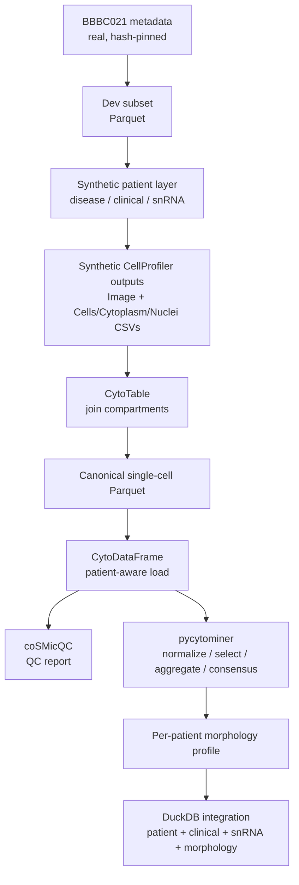

# mock-patient-profile

A **mock, patient-aware morphology profiling workflow** that prototypes the
computational architecture for a future patient-derived fibroblast Cell Painting
screen — built entirely on open data and the open-source Way Science profiling
stack ([CytoTable](https://github.com/cytomining/CytoTable),
[CytoDataFrame](https://github.com/WayScience/CytoDataFrame),
[coSMicQC](https://github.com/WayScience/coSMicQC), and
[pycytominer](https://github.com/cytomining/pycytominer)).

> **This is a mock.** It deliberately avoids vendor-specific tooling and any real
> patient data. It uses the *real* public [BBBC021](https://bbbc.broadinstitute.org/BBBC021)
> plate/well/treatment metadata, but the single-cell morphology features and the
> entire "patient" layer (disease groups, clinical values, snRNA-seq summaries)
> are **synthetic**. The point is to prove out a realistic, reproducible
> architecture that can later be pointed at real fibroblast screening data.

## Architecture



Parquet is the canonical storage format throughout; Polars, PyArrow, and DuckDB
do the data work, with pandas used only where the Way Science tools require it.

## Quickstart

Requires [uv](https://docs.astral.sh/uv/). Clone, sync, and run the whole
workflow with a single command:

```bash
git clone https://github.com/d33bs/mock-patient-profile.git
cd mock-patient-profile
uv sync
uv run mock-patient-profile run
```

This downloads the small BBBC021 metadata, generates a tiny development dataset,
and produces QC reports, per-patient morphology profiles, and an integrated
multi-omic table — in well under a minute. Example output:

```text
mock-patient-profile pipeline complete
  plates=2 wells=40 cells=2400 patients=8
  selected features=36 outlier flags=7 integrated rows=8
  outputs:
    - single_cell: data/processed/single_cell.parquet
    - morphology_profile: data/processed/morphology_profile.parquet
    - integrated_patient: data/processed/integrated_patient.parquet
    - qc_report: data/reports/qc_report.md
    ...
```

Everything is deterministic given the default seed, so results reproduce
run-to-run. Tune the run with flags (all small by default):

```bash
uv run mock-patient-profile run --n_plates 3 --cells_per_site 30 --n_patients 12
uv run mock-patient-profile run --normalize_method mad_robustize
uv run mock-patient-profile info       # version + resolved data directory
uv run mock-patient-profile download   # fetch BBBC021 metadata only
```

## What the pipeline produces

All artifacts land under the (git-ignored) data directory — `./data` by default,
or `$MOCK_PATIENT_PROFILE_DATA`:

| Path                                           | Description                                          |
| ---------------------------------------------- | ---------------------------------------------------- |
| `raw/BBBC021_v1_*.csv`                         | Downloaded, hash-verified BBBC021 metadata           |
| `interim/bbbc021_dev_subset.parquet`           | Small deterministic dev subset (site-level)          |
| `interim/cellprofiler/*.csv`                   | Synthetic CellProfiler-style outputs                 |
| `processed/single_cell.parquet`                | Canonical single cells (CytoTable join + metadata)   |
| `processed/well_profiles.parquet`              | Per-well aggregated profiles                         |
| `processed/patient.parquet`                    | Synthetic patient cohort                             |
| `processed/clinical.parquet`                   | Mock clinical table                                  |
| `processed/snrna_summary.parquet`              | Mock snRNA-seq summary (schema + summary only)       |
| `processed/morphology_profile.parquet`         | **Per-patient consensus morphology profile**         |
| `processed/integrated_patient.parquet`         | DuckDB join of all of the above, one row per patient |
| `reports/qc_*.parquet`, `reports/qc_report.md` | coSMicQC QC tables + Markdown summary                |

## How the mock works

- **Real anchor.** [`bbbc021`](src/mock_patient_profile/bbbc021.py) downloads the
  real BBBC021 image/compound/MoA metadata (SHA-256 pinned for reproducibility)
  and builds a tiny subset (first N plates, mechanism-of-action-annotated
  treatments plus DMSO controls).
- **Synthetic patients.** [`patients`](src/mock_patient_profile/patients.py) maps
  each well onto a synthetic patient across four disease groups (Healthy, Stable
  SV, Fontan Failure, Systolic Failure), so each patient spans multiple plates
  and treatments.
- **Synthetic features with real signal.**
  [`synthetic`](src/mock_patient_profile/synthetic.py) generates CellProfiler-style
  single cells whose features carry three separable, seeded signals —
  disease group (to preserve), mechanism of action (treatment response), and
  plate (batch effect to correct) — so the QC and normalization steps have
  something real to do.

The result is a dataset where disease structure is recoverable, batch effects are
present, and clinical fields correlate with disease severity — a faithful
stand-in for the eventual real screen.

## Repository layout

| Module                                                                                        | Role                                                            |
| --------------------------------------------------------------------------------------------- | --------------------------------------------------------------- |
| [`schema`](src/mock_patient_profile/schema.py)                                                | Canonical `Metadata_` data model + PyArrow schemas + Parquet IO |
| [`paths`](src/mock_patient_profile/paths.py)                                                  | `raw`/`interim`/`processed`/`reports` data layout               |
| [`bbbc021`](src/mock_patient_profile/bbbc021.py)                                              | BBBC021 download + dev subset (Milestone 1)                     |
| [`synthetic`](src/mock_patient_profile/synthetic.py)                                          | Synthetic CellProfiler-style feature generator                  |
| [`patients`](src/mock_patient_profile/patients.py)                                            | Synthetic patient layer (Milestone 6)                           |
| [`cytotable_io`](src/mock_patient_profile/cytotable_io.py)                                    | CytoTable integration (Milestone 2)                             |
| [`cytodataframe_io`](src/mock_patient_profile/cytodataframe_io.py)                            | CytoDataFrame integration (Milestone 3)                         |
| [`qc`](src/mock_patient_profile/qc.py)                                                        | coSMicQC reporting workflow (Milestone 4)                       |
| [`profiling`](src/mock_patient_profile/profiling.py)                                          | pycytominer profiling workflow (Milestone 5)                    |
| [`multiomics`](src/mock_patient_profile/multiomics.py)                                        | Mock clinical/snRNA tables + DuckDB join (Milestone 8)          |
| [`pipeline`](src/mock_patient_profile/pipeline.py) / [`cli`](src/mock_patient_profile/cli.py) | End-to-end orchestration + CLI                                  |

A runnable, step-by-step walkthrough lives in
[`src/notebooks/example_notebook.py`](src/notebooks/example_notebook.py).

## Development

```bash
uv run poe test       # pytest
uv run poe lint       # pre-commit (ruff, codespell, mdformat, vulture, ...)
uv run poe pipeline   # lint + tests
uv run poe profile    # run the end-to-end workflow
```

Tests are hermetic by default. Heavier checks are marked:

```bash
uv run pytest -m "not integration"   # skip the full-stack end-to-end test
MOCK_PATIENT_PROFILE_RUN_NETWORK=1 uv run pytest -m network   # real download
```

## Scope and roadmap

The initial milestones (ingestion, schema, patient layer, the four Way Science
integrations, end-to-end example, and lightweight multi-omic joins) are
implemented. Intentional non-goals for now: deep-learning / foundation-model
workflows, full single-cell genomics (snRNA-seq is summary-only), and
vendor-specific tooling. Batch-correction benchmarking (robust z-score,
sphering, Harmony, ComBat) is the natural next milestone and is left as future
work; the normalization workflow already supports `standardize`,
`mad_robustize`, and `spherize`.

The architecture is designed so that swapping the synthetic feature generator for
real CellProfiler output — and the synthetic patient layer for a real cohort — is
the main change required to run an actual patient-derived fibroblast screen.

## License and citation

BSD-3-Clause (see [`LICENSE`](LICENSE)). If you use this software, please cite it
using [`CITATION.cff`](CITATION.cff).
