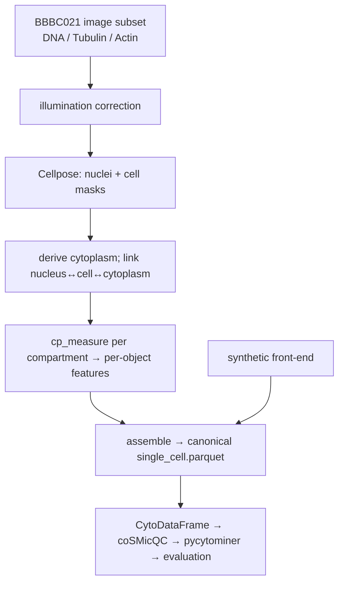

# Imaging front-end plan — raw images → single-cell features

> Status: **plan only, not implemented.** This describes a core, first-class
> addition: a real raw-image → segmentation → feature-extraction front-end based
> on [WayScience/serpula_rasa](https://github.com/WayScience/serpula_rasa)
> (Cellpose + [cp_measure](https://github.com/afermg/cp_measure)).

## Purpose & guiding principle

Today [`synthetic.py`](../src/mock_patient_profile/synthetic.py) fabricates
CellProfiler-style single cells. This plan adds a **real** front-end that
segments raw BBBC021 images and extracts features — as an *interchangeable*
alternative that writes the **same canonical single-cell Parquet**.

The canonical `Metadata_` schema ([`schema.py`](../src/mock_patient_profile/schema.py))
is the contract. Everything downstream (CytoDataFrame → coSMicQC → pycytominer →
evaluation) stays unchanged. We end up with two front-ends behind one schema:

- `synthetic` — fast, deterministic, ground-truth; the CI / controlled-experiment path.
- `imaging` — real Cellpose + cp_measure; the scientific path.

## Where it fits

**CytoTable decision:** cp_measure returns the per-object table directly, so this
path builds the compartment join in Python and **bypasses CytoTable**. Keep
[`cytotable_io.py`](../src/mock_patient_profile/cytotable_io.py) for when real
*CellProfiler* SQLite/CSV exports exist (likely the future fibroblast project).

## Proposed package layout

A new `src/mock_patient_profile/imaging/` package (mirroring serpula_rasa's
`image.py` / `meta.py`):

| Module            | Responsibility                                                                                                                               |
| ----------------- | -------------------------------------------------------------------------------------------------------------------------------------------- |
| `images.py`       | Locate / download / load BBBC021 image triplets for the dev subset (uses the filenames already in `BBBC021_v1_image.csv`)                    |
| `illumination.py` | Per-plate flat-field / background correction (CellProfiler-style)                                                                            |
| `segmentation.py` | Cellpose wrappers: nuclei (DNA) + cells (Tubulin/Actin); derive cytoplasm; link compartments                                                 |
| `measurement.py`  | cp_measure wrappers per compartment → per-object features; map names to the canonical convention                                             |
| `extract.py`      | Orchestrator: images → masks → features → canonical `single_cell.parquet` (the drop-in equivalent of `synthetic.generate_synthetic_dataset`) |

`extract.build_single_cell_parquet_from_images(...)` becomes a second producer of
the exact artifact `pipeline.run_from_subset` already consumes.

## Dependencies & guardrail note

Add an **optional** `imaging` dependency group (kept out of the default install
and default CI): `cellpose>=4`, `cp-measure`, `scikit-image`,
`opencv-python-headless`, `tifffile`. Pin versions for reproducibility.

Cellpose v4 is SAM-based, so this **crosses the original "no deep learning
initially" guardrail** — a deliberate, conscious choice now that imaging is in
scope. cp_measure itself is classical (interpretable features), preserving the
project's spirit; segmentation is the only learned component.

## Data strategy (keep the dev set small)

- Raw BBBC021 images are tens of GB, distributed as **per-week zip archives
  (~GB each)** on the Broad server. **Action: verify download granularity** — if
  we must pull a whole week's zip, the "tiny dev set" is one plate / a few wells
  / 1–2 sites, cached and (where possible) hash-pinned.
- Image download belongs in `imaging.images` (separate from the small metadata
  download already in [`bbbc021.py`](../src/mock_patient_profile/bbbc021.py)).
- For tests, bundle a **tiny synthetic image + mask fixture** (a few painted
  blobs) so the orchestration/linking/naming logic is testable without torch.

## Segmentation & compartment linking (the hard part)

This is where most engineering and scientific choices live:

- **Nuclei** from the DNA channel (Cellpose nuclei model).
- **Cells** from Tubulin/Actin (Cellpose cyto model, seeded by nuclei).
- **Cytoplasm** = cell − nucleus.
- **Relationships:** match each cell/cytoplasm to its nucleus by label overlap —
  i.e. reimplement CellProfiler's IdentifyPrimary/Secondary/Tertiary logic.
  Output an object table keyed by `(Plate, Well, Site, ObjectNumber)` with parent
  links, then measure each compartment with its mask.

Fibroblasts are large and spread, so the cell-boundary channel choice and
touching-cell separation need validation (mask QC) — flag for the PI.

## Feature extraction & naming

- cp_measure exposes Featurizer / Bulk / low-level APIs; pick per dataset size.
- Decide naming: adopt cp_measure names wholesale (downstream only relies on the
  `Metadata_` vs feature split, so it tolerates this) **or** map to the existing
  `Compartment_Family_Measurement_Channel` convention. Either way, update the
  coSMicQC default thresholds in [`qc.py`](../src/mock_patient_profile/qc.py),
  which reference specific feature names.

## Reproducibility

Determinism shifts from a seed to **pinned model weights + tool versions**. Pin
`cellpose` + the model variant + `cp-measure`, and record versions in output
provenance. Document that imaging outputs reproduce per (image, model version),
not per seed.

## Testing & CI

- Unit-test orchestration, compartment linking, and name-mapping on the tiny
  in-memory image/mask fixture (no torch) — fast, runs in default CI.
- Mark the real Cellpose run as `integration` / opt-in (env-gated), **excluded
  from the default CI matrix** (torch is too heavy). The `synthetic` front-end
  remains the CI path.

## Phased milestones

| Phase | Deliverable                                                                                                            |
| ----- | ---------------------------------------------------------------------------------------------------------------------- |
| 0     | This plan + PI alignment (answer the questions below)                                                                  |
| 1     | `imaging.images` — download tiny image subset, load triplets; illumination stub                                        |
| 2     | `imaging.segmentation` — Cellpose nuclei+cells, cytoplasm, linking + mask QC                                           |
| 3     | `imaging.measurement` + `imaging.extract` — cp_measure → canonical Parquet (now interchangeable with `synthetic`)      |
| 4     | Parity validation — run downstream QC/profiling/evaluation on imaging output; compare to `synthetic` on the same wells |
| 5     | Scale-out notes — chunking / parsl / dask, storage & GPU compute (later)                                               |

## Risks

| Risk                                       | Mitigation                                                                         |
| ------------------------------------------ | ---------------------------------------------------------------------------------- |
| Raw image volume vs. "small dev set"       | Target dev-subset sites; verify zip granularity; cache + pin                       |
| torch/Cellpose footprint, not CI-friendly  | Optional dep group; opt-in integration tests; synthetic = CI path                  |
| Compartment linking complexity             | Start from serpula_rasa; explicit IdentifyPrimary/Secondary/Tertiary port; mask QC |
| Illumination/background artifacts          | Per-plate correction before measurement                                            |
| Reproducibility via model weights          | Pin model + versions; record provenance                                            |
| Feature-name drift vs. existing thresholds | Decide naming early; update coSMicQC thresholds                                    |

## Open questions for the analysis PI

**Segmentation & features**

1. What is the lab's standard segmentation approach for fibroblast images —
   Cellpose v4/SAM as-is, or a fibroblast-tuned/custom model? Do we have one?
1. Which channel defines the cell boundary for (large, spread) fibroblasts, and
   how should we handle touching cells and cytoplasm derivation?
1. Is cp_measure acceptable as the canonical feature extractor, or must we match
   an existing **CellProfiler** feature set for comparability with prior data?
   Which feature families/channels actually matter?
1. Is per-plate illumination correction required, and by what method?

**Profiling, normalization & design**

5. Normalization: control-based (per-plate to negative controls) or whole-plate?
   What are the negative controls in the assay?
1. What is the right **aggregation grain** for a "patient profile" — per patient,
   per (patient × treatment), or DMSO baseline only? Consensus by median or MODZ?
1. Expected **batch structure** (plate / day / operator), and will disease be
   confounded with batch in the real plating plan? Can we randomize plate layout?
1. Which batch-correction methods should we benchmark, and what's the acceptance
   bar for "biology preserved, batch removed"?

**Evaluation & success**

9. What is the primary endpoint (disease-group separation, drug response, a
   specific clinical correlate)?
1. Which metrics define success, with thresholds (mAP / percent-replicating,
   batch-mixing targets)? Standardize on `copairs` / `cytominer-eval`?
1. What replicate reproducibility is "good enough" to trust a profile?

**Cohort, scale & data governance**

12. Cohort size (patients, replicates, plates) — for power and storage/compute
    planning — and the real disease groups / clinical variables (confirm the
    mock's Healthy / Stable SV / Fontan Failure / Systolic Failure).
01. Where will raw images and outputs live, and what compute (GPU for Cellpose)?
01. Is snRNA-seq paired per patient, at what resolution (summary vs. full), and
    what integration question are we actually answering (morphology ↔ expression)?
01. PHI / data-sharing constraints on patient data (affects public vs. private
    infrastructure and reproducibility expectations)?
